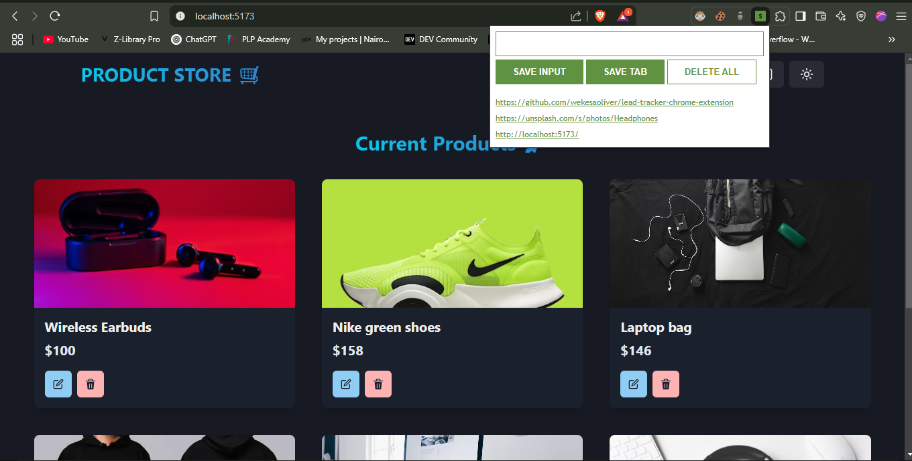

# Lead Tracker Chrome Extension

## Overview

The Lead Tracker Chrome Extension is a tool designed to help users efficiently track and manage their leads directly from their browser. This extension leverages various JavaScript concepts to provide a seamless and interactive user experience.



## Features

- **Add Leads**: Easily add new leads with a simple input form.
- **View Leads**: Display all saved leads in a user-friendly format.
- **Local Storage**: Persist leads data using the browser's local storage.
- **Delete Leads**: Remove individual or all leads with a single click.

## JavaScript Concepts Utilized

This project utilizes the following JavaScript concepts:

- **const**: For declaring constants.
- **addEventListener()**: To handle user interactions.
- **innerHTML**: For dynamically updating the HTML content.
- **input.value**: To retrieve user input values.
- **Function Parameters**: For passing data to functions.
- **Template Strings**: For creating dynamic HTML templates.
- **Local Storage**: To store and retrieve leads data.
- **The JSON Object**: For parsing and stringifying data.
- **Objects in Arrays**: To manage and manipulate leads data.

## Installation

1. Clone the repository:
   ```sh
   git clone https://github.com/yourusername/lead-tracker-chrome-extension.git
   ```
2. Open Chrome and navigate to `chrome://extensions/`.
3. Enable "Developer mode" in the top right corner.
4. Click "Load unpacked" and select the cloned repository folder.

## Usage

1. Click on the Lead Tracker extension icon in the Chrome toolbar.
2. Use the input form to add new leads.
3. View and manage your leads directly from the extension popup.

## Contributing

Contributions are welcome! Please fork the repository and submit a pull request.

## License

This project is licensed under the MIT License.
